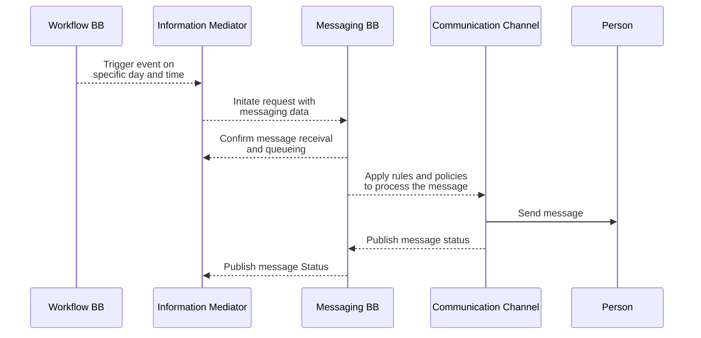
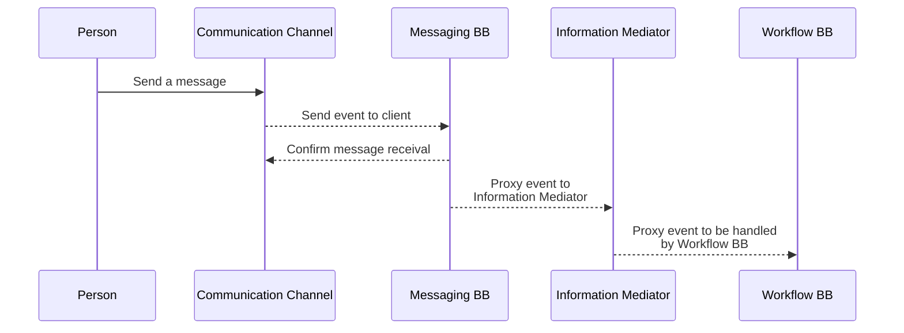

# 9 Internal Workflows

A workflow provides a detailed view of how this Building Block will interact with other Building Blocks to support common use cases.

This section lists workflows that this Building Block must support. Other workflows may be implemented in addition to those listed.

## 9.1   Workflow diagram 

### 9.1.1 Prerequisites and dependencies 

The main prerequisite for Person-to-Building Block communication is that there is an existing Sender/Source Building Block with the following properties:

* the relevant credentials and details about the Person/Citizen to be addressed with;
* the content of the message and a reference to a communication channel (contact details) to be used;
* additionally, the service discovery service at the Information Mediator Building Block needs to be active. Information Mediator Building Block publishes the list of available services of the Messaging Building Block to the source GovStack Building Block, i.e. Workflow.

A reference token should be carried throughout the communication session in order to save a point of reference for reverse communication back from the Person to the Building Block. In other words, the main prerequisite for Person-to-Building Block communication is the availability of a communication channel and a reference token.

#### **9.1.1.1      Description**

This generic workflow is used to transfer messages between GovStack Building Block and the end user, Person. Data is submitted from a GovStack Building Block front-end application. This workflow shows a connection to GovStack Building Block (such as a government Health System Application) to convey a message that is associated with a real person.

#### **9.1.1.2      Interaction with Other Building Blocks**

This workflow requires interaction with the Information Mediator Building Block and a source GovStack Building Block, for example, a Health Care Service Building Block or registry Building Block.

#### **9.1.1.3      Sequence Diagram**

The sequence diagram shows the flow of data between Building Blocks for this workflow.

#### Messaging: Government to Person (G2P)

#### Messaging: Person to Government (P2G)

## **9.2 Interactions**

### **9.2.1 Government/BB to Person communication**

<table data-header-hidden><thead><tr><th width="141.33333333333331">Name</th><th width="271">Required Data</th><th>Notes</th></tr></thead><tbody><tr><td>Messaging Building Block accepts a message from GovStack publisher</td><td>Publisher Building Block or service conforming to the Messaging BB schema</td><td>Reject messages that do not comply with expected schema</td></tr><tr><td>Retrieve Person and Contact Channel Data from the incoming Message </td><td>Map retreived data with appropriate recipient</td><td>Technical mapping is an internal service of the Messaging BB </td></tr><tr><td>Publish Message through Communication Channel</td><td>Communicate Message Data and User ID to Communication Channel</td><td>Reject messages that do not comply with expected schema</td></tr><tr><td>Publish Status for the original sender</td><td>User and Message IDs with Delivery Status containing date and time</td><td>The Message's unique ID is preserved to keep up its status updated</td></tr></tbody></table>

### **9.2.2** Person to Government/Building Block communication

<table data-header-hidden><thead><tr><th width="164.33333333333331">Name</th><th>Required Data</th><th>Notes</th></tr></thead><tbody><tr><td>Message sent through the communication channel / service provider</td><td>Text message and User ID</td><td>Reject messages that do not comply with expected schema</td></tr><tr><td>Retrieve Person and Contact Channel Data from the incoming Message </td><td>Map retreived data with appropriate recipient</td><td>Technical mapping is an internal service of the Messaging BB </td></tr><tr><td>Confirm message received</td><td>Message Delivery Data Structure following Communication Channel standards with Status</td><td>The Message unique ID is collected to keep up other statuses updated</td></tr><tr><td>Publish Status for the original sender</td><td>User and Message IDs with Delivery Status containing date and time</td><td>The Message's unique ID is preserved to keep up its status updated</td></tr></tbody></table>
